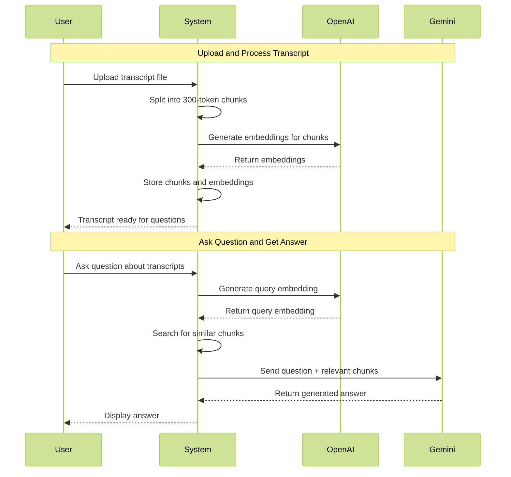
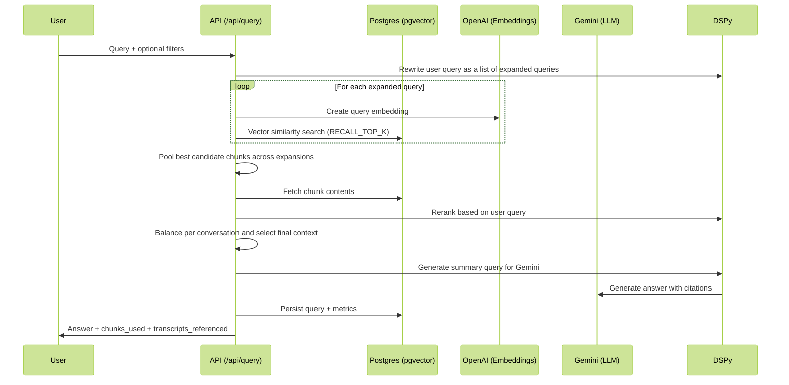

When I first heard about DSpy it was from other evangelists who had fallen in
love with it. Whenever I was faced with an issue, they suggested trying DSpy
first. These are people I respected, and so I'd start by reading the website and
getting a feel for what it does. This seems nice enough, I thought, maybe I'll
get around to it at some point.

I finally got around to trying it, and I am now here to tell you that you have
to try DSPy if you are writing LLM applications.

If you want to know more about the background behind DSPy or why it exists, I'd
recommend this video by one of its creators, [Michael
Ryan](https://michryan.com/)

<iframe width="560" height="315" src="https://www.youtube.com/embed/s85YY3myQLw?si=bwFKsJqiVB87eJKy" title="YouTube video player" frameborder="0" allow="accelerometer; autoplay; clipboard-write; encrypted-media; gyroscope; picture-in-picture; web-share" referrerpolicy="strict-origin-when-cross-origin" allowfullscreen></iframe>

This is not going to be that. Instead, I'm going to walk you through a real-life
use case I have, and how DSPy simplified it for me.

## The Initial Project

Here's a rough outline of a project I had. I have a dataset of transcripts
between callers and sellers. Imagine a single row with some metadata, such as
the name of the company, date, and so on, as well as the full transcript
annotated with Speaker A: \<text> Speaker B: \<text>

There could be tens of thousands of these transcripts, and they contain a wealth
of knowledge that could be very useful for people from all kinds of roles, from
sales, to marketing, to product.

I wanted to build a means for users to ask arbitrary questions of this dataset
and get relevant answers. 

In order to do this, I built a relatively simple RAG-architecture.

Transcripts were split into small 300-token chunks, ensuring they were split at
speech boundaries. Each chunk was converted to an embedding via OpenAI for fast search
retrieval, and saved to a pgvector database along with relevant metadata. 

Redis was used to manage jobs and workers. 

When a user queried the system, that search term would be converted to an
embedding and used to return the most similar chunks from the transcripts. Those
chunks were then provided along with the user's query to a Gemini 2.5 Pro model.
The answer to the query would then be returned to the user.



While my first approach seemed to work and produced results that were not
obviously wrong, I had three ideas on how I could further improve it. 

First, I wanted to rewrite the query from the user before doing embedding
search. Second, I wanted to rerank the results from the embedding search. And
finally, I wanted to improve the final output from Gemini.

## Rewriting the embedding query

The first problem I found was that the user query could vary from simple to
complex and would be written by users who are trying to solve business problems,
not semantic search problems. These queries may not retrieve the best chunks
from transcripts, especially if they are very long or contain phrases that are
not obviously related to the content they should refer to. 

A simple example might be:

> What are the top integrations mentioned by customers

This is a perfectly fine question but not a great semantic query. I wanted to
add a query rewriter prior to performing semantic search on the embeddings in
order to improve the search results. I almost considered writing the prompt by
hand, but thought I'd finally have a reason to give DSPy a try.

Here's the full code that I ended up using: 

```python
class RewriteQuery(dspy.Signature):
    """Rewrite the user's query to be used in embedding search against customer call transcripts. 
    Data is from a data orchestrator B2B company and contains calls with prospects and customers."""
    user_query: str = dspy.InputField(desc="User's query which will be used to summarize selected transcripts")
    context: str = dspy.InputField(desc="A sample of transcript data")
    query_phrases: list[str] = dspy.OutputField(desc="a list of 5-10 queries that feed semantic search to get chunks of transcripts")

# Provide some general context
df = pd.read_csv('../data/transcript.csv', nrows=5)
context = df.to_dict(orient='records')

# Sample implementation
query = "What are the top integrations mentioned by customers?"
rewrite = dspy.ChainOfThought(RewriteQuery)
response = rewrite(user_query=query, context=context)
response.query_phrases
> ['customer integrations',
 'data orchestration tools',
 'ETL processes used by customers',
...
 'customer tech stack',
 'data pipeline tools',
 'SaaS integrations',
 'data warehouse integrations',
 'customer data sources']
```

Let's break down what is happening here and how this is different from the
traditional approach.

Normally, I would open up my favorite LLM UI of the day, and iterate on a prompt
along the lines of: "You are an expert query rewriter....YOU MUST RESPOND IN JSON.
MY JOB DEPENDS ON IT. HERE IS THE JSON STRUCTURE. DO NOT USE CODE FENCES." 

And over and over again I'd add more angry sounding words until I got an answer
that looked good enough. I'd add lots of sanitization logic to try and clean the
output, then I'd copy paste my prompt as a string and hope I never need to
change it.

Instead, with DSPy I'm using a declarative model to write my specs. I have two
inputs, I need an output, and here is some semantic information around how these
things relate. DSPy then creates the prompt to solve my goal. 

Now you could certainly do all of this without DSPy, but the real benefits were
that 1) this took very little time to do, 2) enables modular building as we'll
see shortly and 3) can improve itself through evaluations and optimizations.

In DSPy you can define a signature in a few ways, in this example I've chosen
one of the more complex ones. You could simplify the implementation further with
inline signatures too:

```python
rewrite = dspy.ChainOfThought('user_query, context -> query_phrases') 
response = rewrite(user_query=query, context=context)
```

This would honestly work pretty well too as a starting point, but on the advice
of other DSPy evangelists, I opted for slightly more context.

With my first task complete, I was ready for the second.

## Reranking Results

Now that I was able to generate some candidate search terms against the
embeddings, I wanted a way to re-rank the results. I have a large collection of
**potentially** relevant chunks of transcripts, but not all of them will be
relevant and I need to cull the list down to something more manageable. Ideally,
ranked in some order based on the user's original query, and not just the
rewritten queries.

I considered reading about reranking and the proper way to do it, but instead, I
thought I have DSPy, why shouldn't everything be a DSPy-sized problem? 

Here's how simple it was to implement a reranker:

```python
class QueryResult(pydantic.BaseModel):
    id: str
    score: float

class ChunkReranker(dspy.Signature):
    """Rerank chunks of text based on their relevance to the user's query.
    """
    user_query: str = dspy.InputField()
    chunks: list[dict] = dspy.InputField()
    ranked_chunks: list[QueryResult] = dspy.OutputField(desc="A list of chunks ranked by relevance to the user query")

rerank = dspy.ChainOfThought(ChunkReranker)
response = rerank(user_query="What is the most used integrations?", chunks=unranked_chunks)
print(response.reasoning)

> """The user is asking about the most used integrations, which suggests they
> are looking for information related to data integration tools or
> platforms. The chunks provided contain discussions about data workflows,
> integrations with Snowflake, and the use of dbt for data transformation. The
> most relevant chunks will likely discuss specific integrations or tools
> that are commonly used in data processing and analytics. Chunks that mention
> Snowflake, dbt, and data ingestion processes will be prioritized as they
> directly relate to integrations in a data context."""

(response.ranked_chunks)
> [QueryResult(id='3', score=0.9),
 QueryResult(id='7', score=0.85),
 QueryResult(id='8', score=0.8),
...
 QueryResult(id='2', score=0.65),
 QueryResult(id='4', score=0.6),
 QueryResult(id='0', score=0.5),
 QueryResult(id='6', score=0.45),
 QueryResult(id='9', score=0.4)]
```

Being able to introspect the model's reasoning is really helpful to understand
how much of the question was actually understood. Note, I didn't say anything about
the particular use case, or what the goals were for reranking, or even that it
should be focused on data tools. Instead, I simply provided the user's question,
and a collection of transcripts and let the model figure out my intent, and it
did a great job. 

If I change the user query, the reasoning changes with it:

```python
response = rerank(user_query="What are the biggest pain points?", chunks=json.dumps(chunks_dict))
print(response.reasoning)
> """The user is asking about the biggest pain points, which suggests they are
  looking for challenges or issues faced by the individuals in the
  conversation. The most relevant chunks will likely contain discussions about
  current challenges, workflows, and any problems that the team is experiencing.
  Chunks that mention specific pain points or concerns regarding their data
  processes, workflows, or scaling issues will be prioritized."""

```

Pretty incredible stuff. 

And finally, it's time to add a summarizer. Now, I already had this feature
prior to using DSPy but it felt a natural fit to move the existing prompt into
DSPy's control. 

```python
class Summarizer(dspy.Signature):
    chunks: list[str] = dspy.InputField(desc="chunks from call transcripts between sellers and prospects")
    query: str = dspy.InputField(desc="query from a user")
    summary: str = dspy.OutputField(desc="answer to the user's query based on provided chunks. Attribute quotes using customer's name and transcript ids when possible.")

summarizer = dspy.ChainOfThought(Summarizer)

(Note this output is based on synthetic data)

print(response.reasoning)
> """The provided chunks indicate that the customers are using several
  integrations in their data workflows. Specifically, they mentioned using
  Snowflake as their data warehouse, dbt for data transformation, and Celery for
  orchestrating workflows. Additionally, they are retrieving data from
  third-party APIs and sometimes writing to PostgreSQL before syncing to
  Snowflake. These integrations are crucial for their data ingestion and
  processing pipelines."""

print(response.summary)
> """The main integrations used by the customers include Snowflake as their data
  warehouse, dbt for data transformation, and Celery for orchestrating
  workflows. They also retrieve data from third-party APIs and occasionally
  write to PostgreSQL before syncing to Snowflake."""
```

Here's the overall flow of the application in its current state:



## Wrapping Up

This was a short introduction to using DSPy for building the foundations of
LLM-based applications in a more declarative way. This is just scratching the
surface, and the real power of DSPy will come once evaluations and optimizations
come into play. But even without those features, DSPy offers a powerful way for
quickly building and iterating on applications in a way that makes coding with
LLMs feel more like software engineering again.
