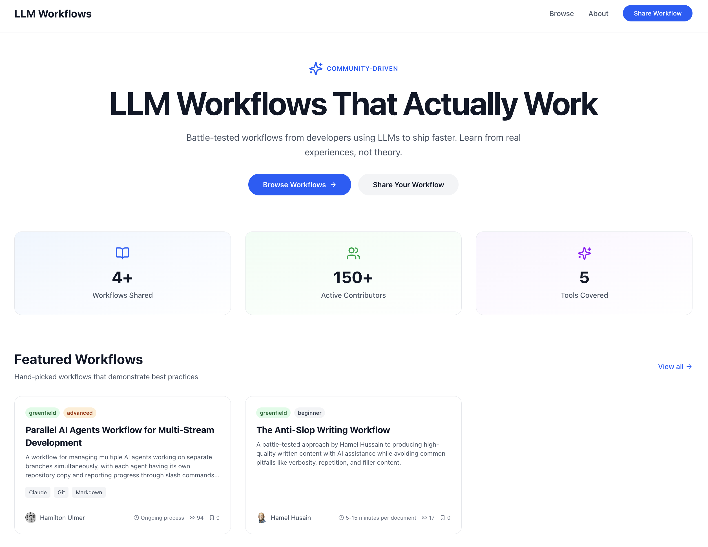
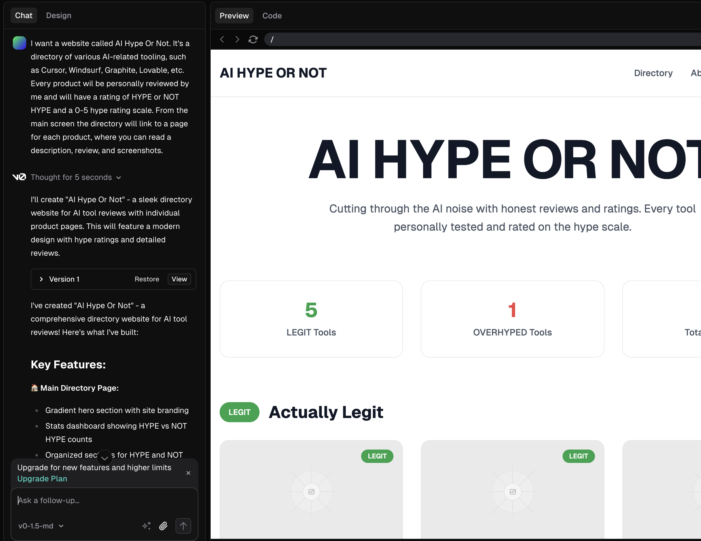
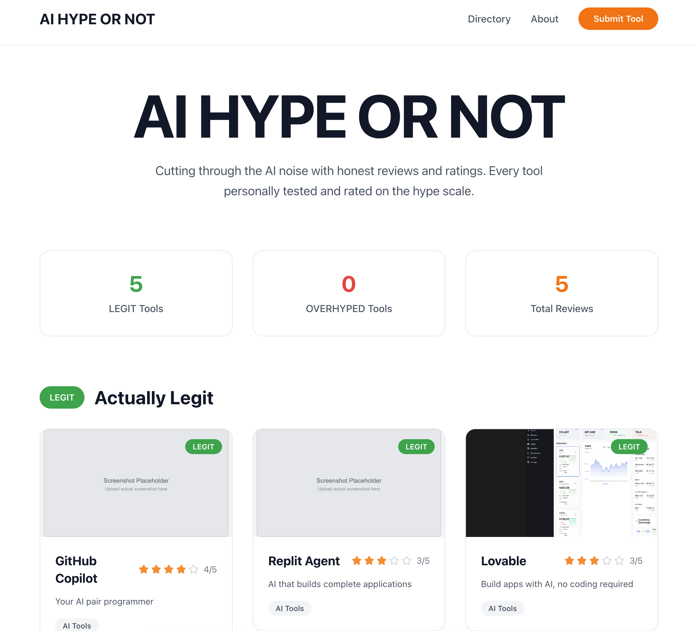
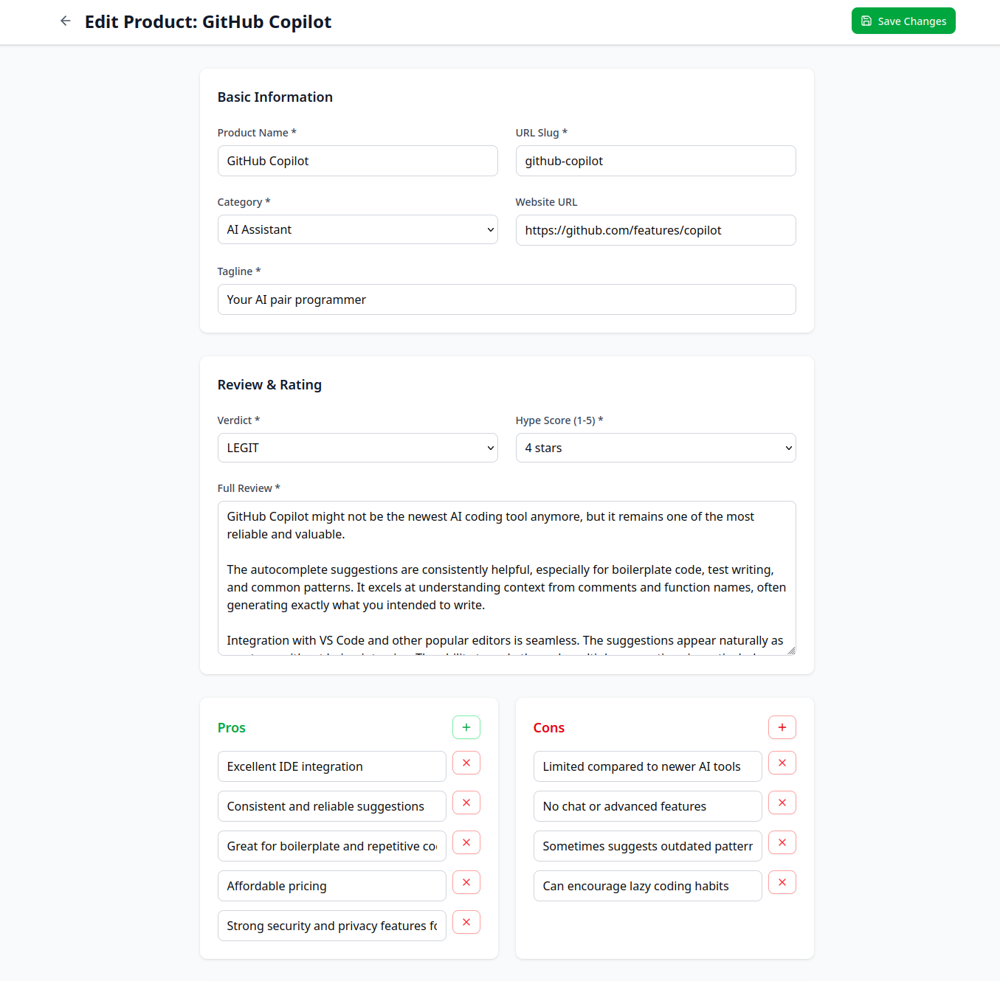
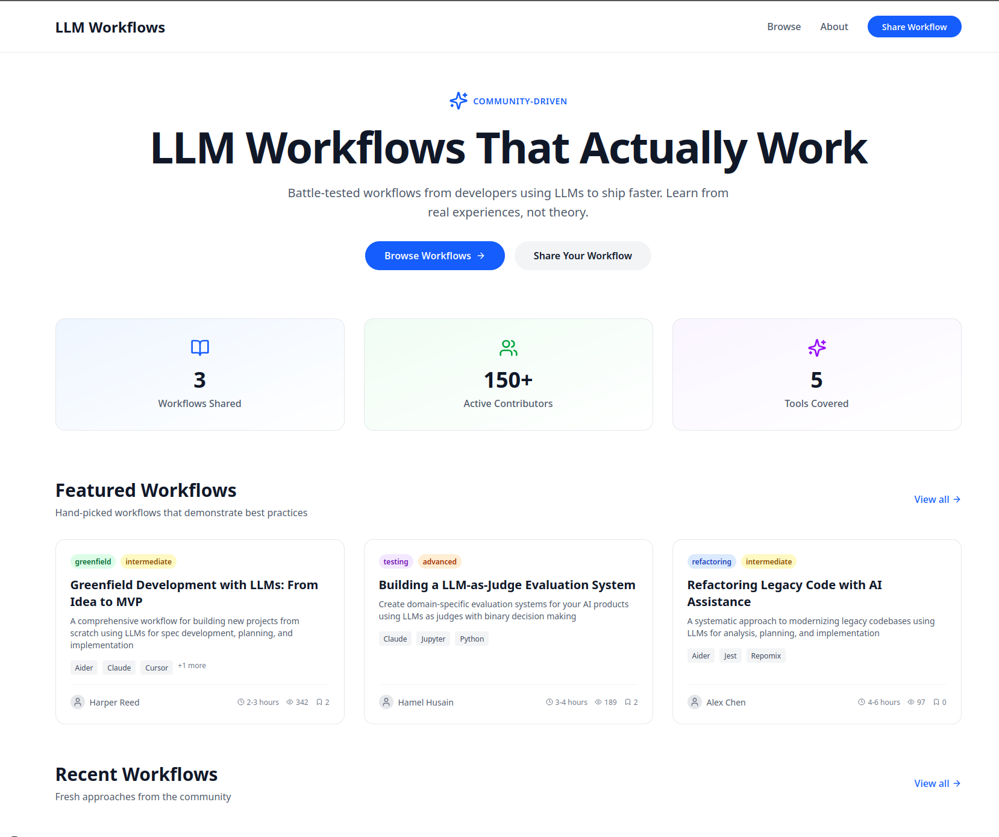
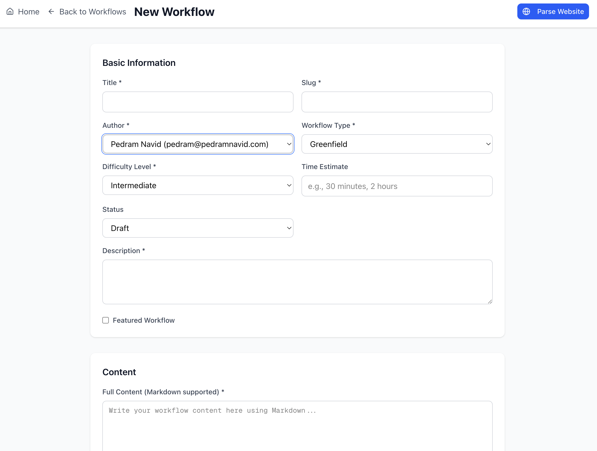
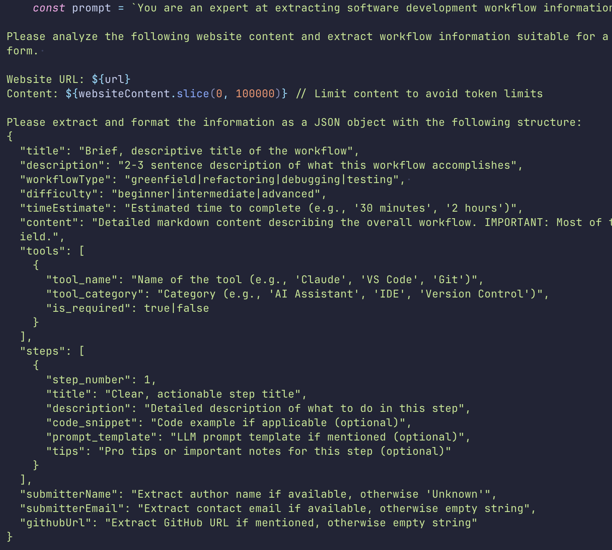
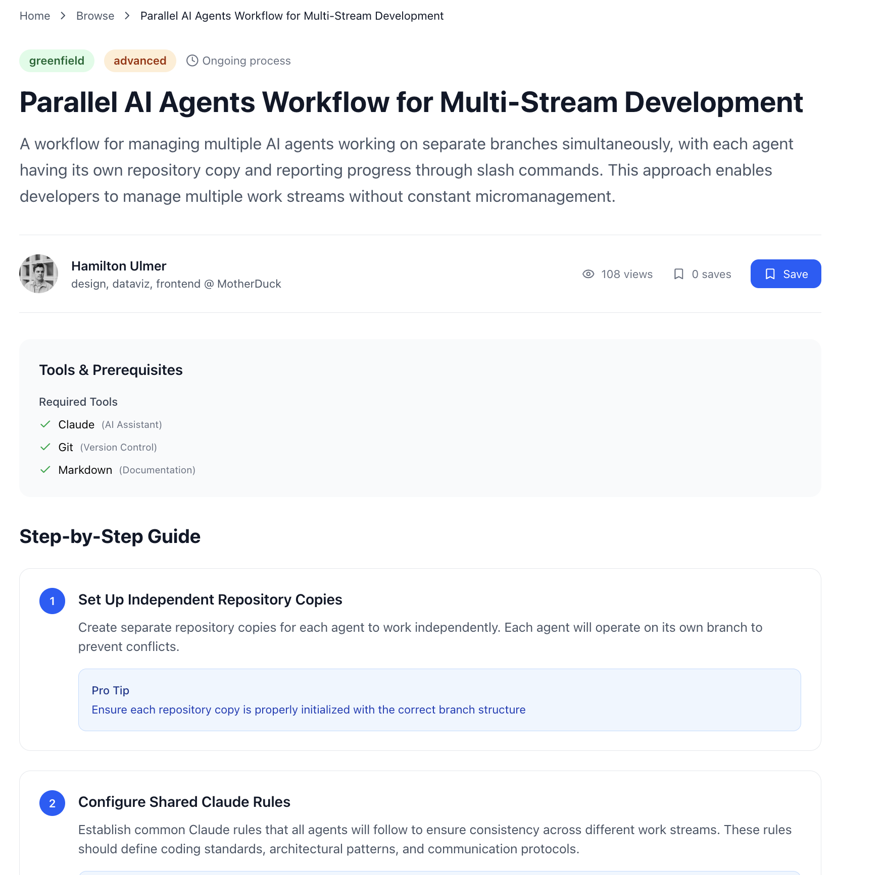

I had a few days off work and wanted to ship a side project while also getting a chance
to become more intimate with the latest generation of AI tools. 



## A First Attempt

My first idea was a directory of AI tools, with hands-on reviews and a rating I'd give. 
It would require dedicated time to each tool to try and give an unbiased review of all the 
tools in the AI ecosystem that I was curious about, affectionately called AI Hype Or Not.

I started with v0 for the initial prototype. I gave v0 the rough idea I had in my head, 
and then iterated on the initial design. One thing that is very powerful is giving it examples
of sites and designs you like and having it use that as inspiration. 




This initial phase took me about ten minutes. From here, I pulled the code locally and started
iterating with Claude Code.

## Claude Code is Cracked

I'm using Anthropic's Claude Pro subscription with Claude Code and it's been a dream to work with.
I know I have other options for continuing to build the site, such as Lovable, Replit, and others,
but I've always found that I work best in the terminal with Claude Code, rather than prompting
through a site and having it build in the background for me.



Iterating with Claude Code was so fast here. I got the shell of the site up, but realized that
creating content for it is actually more difficult than it should be. While v0 had most of the content
stored as hard-coded text, Claude and I moved this over to a Neon database. But updating content
in a database isn't always painless, and opening a database editor just to create content sucked.

One of the best parts of being able to build with AI tools is how quickly you can change directions.
Normally, I'd reach for either a CMS, or an admin panel. A headless CMS can ease some of the burden
of creating content, but can also be overpowered for my needs. An admin panel would be simpler,
but it usually involves a lot of annoying code, creating forms for each field you care about,
and handling the display of it all in an intuitive way.

So instead, I asked Claude what we should do, and it told me than an admin panel is very simple to
implement, so I said why not. I normally hate dealing with oauth and callbacks, but I asked if we could
support GitHub and Google Auth. Claude didn't blink

I used Plan Mode, and here's the initial plan:

```markdown
Phase 1: Authentication Setup (Day 1-2)

 1. Install NextAuth.js and configure GitHub/Google OAuth providers
 2. Create protected /admin route structure with middleware
 3. Add admin user identification (your GitHub/Google email)
 4. Test authentication flow and protected routes

 Phase 2: Admin Dashboard MVP (Day 3-5)

 1. Products Management Interface
   - List all products with edit/delete actions
   - Add new product form
   - Edit existing products (name, category, verdict, hype score, review content)
   - Manage pros/cons lists
 2. Submissions Review Interface
   - View all user submissions from the contact form
   - Mark submissions as reviewed/rejected
   - Basic submission details display
 3. Simple Analytics Dashboard
   - Product count by verdict (LEGIT vs OVERHYPED)
   - Recent submissions overview
   - Basic statistics

 Phase 3: Enhanced Features (Day 6-7)

 1. Image/Screenshot Management
   - Upload new screenshots for products
   - Manage existing screenshots
   - Image optimization and storage
 2. Bulk Operations
   - Batch delete submissions
   - Bulk update product categories
   - Export data functionality

 Tech Implementation

 - NextAuth.js for OAuth authentication (GitHub + Google)
 - Server Actions for form submissions and data mutations
 - Your existing UI components (maintain design consistency)
 - Role-based access (admin-only routes protected by middleware)
 - Database operations via your existing lib/db.ts utilities
```

I let Claude cook, and some 40,000 tokens and 50 minutes later, it was done. Nearly every feature was
implemented. 



## A Complete Pivot

I was pretty happy with the overall project, it was about 70% done and I was creating the content 
for it when my good friend Jacob Matson gave me a better idea. Instead of a review of tools, what
about a place where you can share, capture, and find AI and LLM-related workflows? 

Today there are tons of great pieces of content and they live largely in bookmarks scattered among
friends. What if there was a site that aggregated all these great workflows and tips in a single place?

Normally, I'd be annoyed to even get a suggestion when I was nearly done building, but I asked Claude
if he's down and as always, Claude was. 

I told Claude to convert the website, and it took care of nearly everything in a single shot. Database
migrations, new admin panel, updating content. There was still some manual intervention required and
I still find myself opening up a code editor to review and edit by hand, but by and large 90% of the 
pain was gone.



This is really the biggest benefit in my mind of working with these tools. It frees you up to think
about what's next, rather than how to implement what is happpening now. However, domain expertise 
still remains important in my mind. A lot of my success with Claude has been because I've been able
to carefully guide it where I need to to focus on, and to avoid going down paths it shouldn't. 

I review every plan and aggressively cut scope where I can. Claude tends to be more ambitious than is 
warranted.

## The LLMification 

Now that I had a site I was happy with, all that was left was to populate it with some content.
I had found some great content written by the likes of Hamilton Ulmer, Hamel Husain, and Harper 
Reed, and had started manually populating the admin panel. 



It seems obvious that a lot of this content could be pre-fetched from websites that I am reading. Once
again I asked Claude to allow me to parse a website and pre-fill the content submission form, and it
largely did this without complaining. It even created a decent prompt, and handled all the JSON parsing
needed. 



## Ship It

With that last change, the site was ready to go. I created a few boilerplate pieces of content and now am 
ready to start populating it with useful workflows and tips.

Here's an example one from Hamilton Ulmer. 




